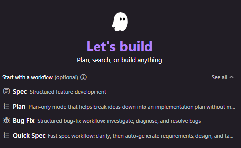

# Kiro 워크플로 총정리 (Default 포함)

> **대상 버전:** Kiro IDE 1.0 (최신 1.0.x 릴리스 기준, 1.0.52 이상)
> Spec / Plan / Bug Fix / Quick Spec 워크플로는 IDE 1.0에서 제공되는 구성입니다.
> 출처: [Kiro IDE Changelog](https://kiro.dev/changelog/ide/)

Kiro 세션을 시작할 때 작업 성격에 맞는 진행 방식을 고를 수 있습니다.
아무것도 고르지 않으면 Default(일반 대화형)로 동작하고, 나머지 4개는 각각
목적이 다른 구조화된 흐름입니다.

## 목차

1. Default (워크플로 미선택 / Vibe)
2. Spec — Structured feature development
3. Plan — Plan-only mode
4. Bug Fix — Structured bug-fix workflow
5. Quick Spec — Fast spec workflow
6. 한눈에 비교
7. 고르는 기준 요약

---

## 1. Default (워크플로 미선택 / Vibe)

**특징**
- 워크플로를 고르지 않았을 때의 기본 대화형 모드입니다.
- 요구사항/설계/태스크 같은 문서 단계 없이, 질문하면 바로 답하고 코드도 즉시 수정합니다.
- 탐색적 코딩, 빠른 Q&A, 소규모 수정에 가장 적합합니다.
- 문서 산출물이 남지 않으므로 가볍고 빠른 대신 구조/추적성은 약합니다.

**언제 쓰나**
- 한두 파일 수정, 버그 원인 질문, 개념 설명, 리팩터링 아이디어 논의 등

**예시 프롬프트**
- "이 함수에서 null 체크 빠진 곳 찾아서 고쳐줘"
- "React에서 useEffect 의존성 배열 규칙 설명해줘"
- "이 로그 에러가 왜 나는지 원인 알려줘"
- "utils.ts의 날짜 포맷 함수 좀 더 읽기 쉽게 리팩터링해줘"

---

## 2. Spec — Structured feature development

**특징**
- 기능을 요구사항 → 설계 → 구현 태스크 3단계 문서로 정형화해 만드는 흐름입니다.
- 산출물: `requirements.md`, `design.md`, `tasks.md` (`.kiro/specs/<기능명>/`).
- 각 단계에서 사용자와 합의 후 진행하므로, 복잡한 기능을 통제 가능하게 점진 구현합니다.
- Requirements-First 또는 Design-First 순서를 config로 지정할 수 있습니다.
- 규모가 크거나 여러 파일에 걸친 기능, 근거 추적이 필요한 작업에 적합합니다.

**언제 쓰나**
- "결제 모듈 추가", "인증 시스템 구축"처럼 설계 합의가 필요한 큰 기능

**예시 프롬프트**
- "사용자 알림 기능을 spec으로 만들자. 이메일/푸시/인앱 3채널을 지원해야 해"
- "장바구니에 쿠폰 적용 기능을 추가하는 spec을 시작하자"
- (단계 진행 시) "requirements 확정됐으니 design 단계로 넘어가줘"

---

## 3. Plan — Plan-only mode

**특징**
- 계획만 세우고 코드는 건드리지 않는 모드입니다.
- 아이디어를 실행 가능한 구현 계획(단계, 접근법, 고려사항)으로 분해해 줍니다.
- 방향을 먼저 잡고 검토받은 뒤 실제 구현으로 넘어가고 싶을 때 유용합니다.
- Spec만큼 무겁지 않고 문서 3종을 강제하지 않으며, 설계/전략 논의에 집중합니다.

**언제 쓰나**
- 구현 전 접근 방식을 비교/검토할 때, 마이그레이션/리팩터링 전략을 짤 때

**예시 프롬프트**
- "이 모놀리식 앱을 마이크로서비스로 쪼개는 계획만 세워줘. 코드는 아직 건드리지 마"
- "레거시 jQuery 코드를 React로 점진 이관하려는데 단계별 계획을 짜줘"
- "성능 병목을 줄이기 위한 개선 계획을 우선순위와 함께 제안해줘"

---

## 4. Bug Fix — Structured bug-fix workflow

**특징**
- 버그를 조사(investigate) → 진단(diagnose) → 해결(resolve) 순서로 구조화해 처리합니다.
- 보통 `bugfix.md` → `design.md` → `tasks.md` 흐름으로 진행됩니다.
- 핵심 방법론: 버그를 재현/증명하는 테스트를 먼저 만들고, 수정 전에는 FAIL(버그 존재 증명), 수정 후 PASS로 바뀌는지 확인합니다.
- 보존(preservation) 테스트는 수정 전후 모두 PASS여야 합니다(회귀 없음).
- 원인이 불명확하거나 회귀 위험이 있는 버그에 특히 적합합니다.

**언제 쓰나**
- 재현 조건이 애매한 버그, 이미 여러 번 재발한 버그, 근본 원인 파악이 필요한 결함

**예시 프롬프트**
- "로그인 후 새로고침하면 세션이 풀리는 버그를 bug fix 워크플로로 잡아줘"
- "특정 조건에서 합계 금액이 음수로 계산되는 버그를 조사부터 해결까지 진행해줘"
- "간헐적으로 발생하는 파일 업로드 실패 원인을 찾아 재현 테스트부터 만들어줘"

---

## 5. Quick Spec — Fast spec workflow

**특징**
- Spec의 경량/고속 버전입니다. clarify(질문으로 요구 명확화) → requirements → design → tasks → review를 빠르게 자동 생성합니다.
- 각 단계에서 길게 합의하기보다 자동 생성 후 리뷰하는 방식이라 속도가 빠릅니다.
- 중간 단계가 상대적으로 조용히(silent) 진행되어, 진행 지점은 실제 생성된 spec 파일 유무로 판단하는 경우가 많습니다.
- Spec 전체 프로세스까지는 필요 없는 중간 크기 작업에 적합합니다.

**언제 쓰나**
- 요구가 비교적 명확하고, 무거운 합의 과정 없이 문서 세트를 빠르게 뽑고 싶을 때

**예시 프롬프트**
- "댓글에 좋아요/싫어요 기능 추가를 quick spec으로 빠르게 정리해줘"
- "CSV 내보내기 기능을 quick spec으로 요구사항부터 태스크까지 자동 생성해줘"
- "프로필 이미지 업로드 기능을 quick spec으로 만들어줘. 궁금한 건 먼저 물어봐"

---

## 6. 한눈에 비교

| 워크플로 | 코드 수정 | 산출 문서 | 속도 | 적합한 작업 |
|---|---|---|---|---|
| Default | 즉시 함 | 없음 | 가장 빠름 | Q&A, 소규모 수정, 탐색 |
| Spec | 태스크 단계에서 | requirements/design/tasks | 느림(신중) | 크고 복잡한 신규 기능 |
| Plan | 안 함(계획만) | 계획 | 빠름 | 접근법 검토, 전략 수립 |
| Bug Fix | 진단 후 수정 | bugfix/design/tasks | 중간 | 원인 불명확/회귀 위험 버그 |
| Quick Spec | 태스크 단계에서 | requirements/design/tasks | 빠름 | 명확한 중간 규모 기능 |

---

## 7. 고르는 기준 요약

- 그냥 물어보거나 바로 고칠 것 → **Default**
- 큰 기능을 신중하게 설계부터 → **Spec**
- 코드는 나중, 방향부터 잡기 → **Plan**
- 버그를 근본 원인까지 → **Bug Fix**
- 명확한 기능을 빠르게 문서화 → **Quick Spec**
